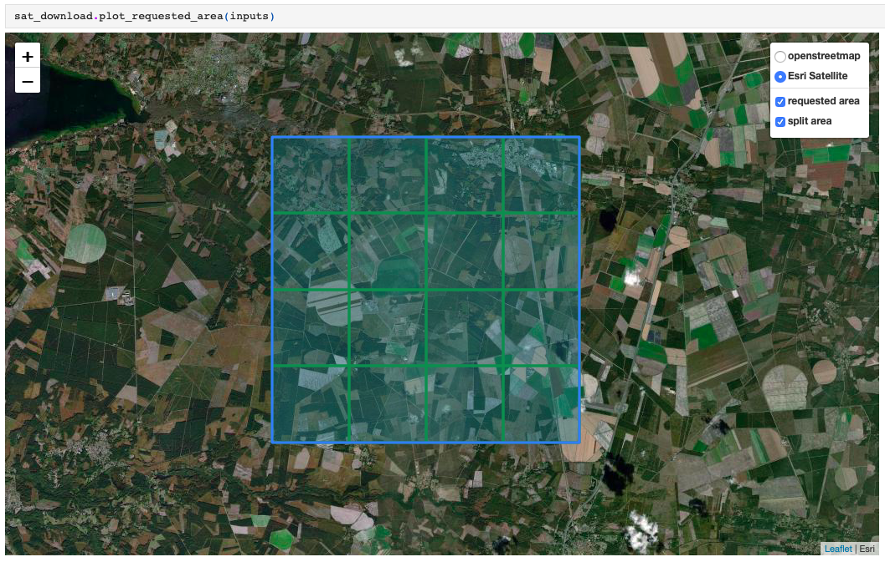
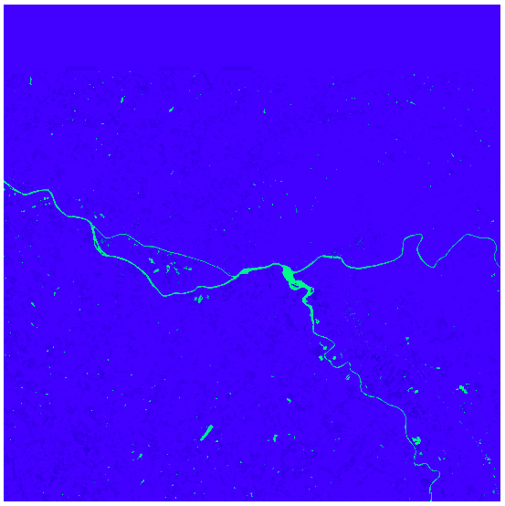
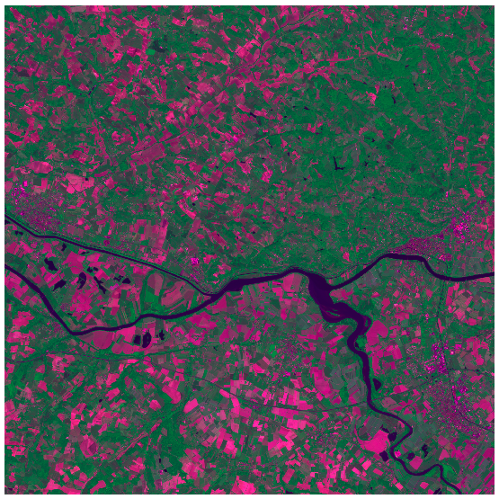
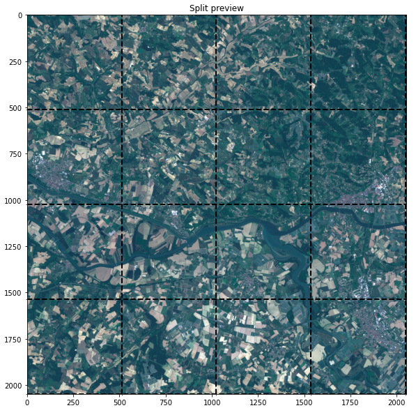
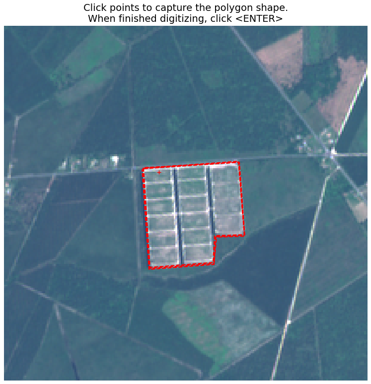
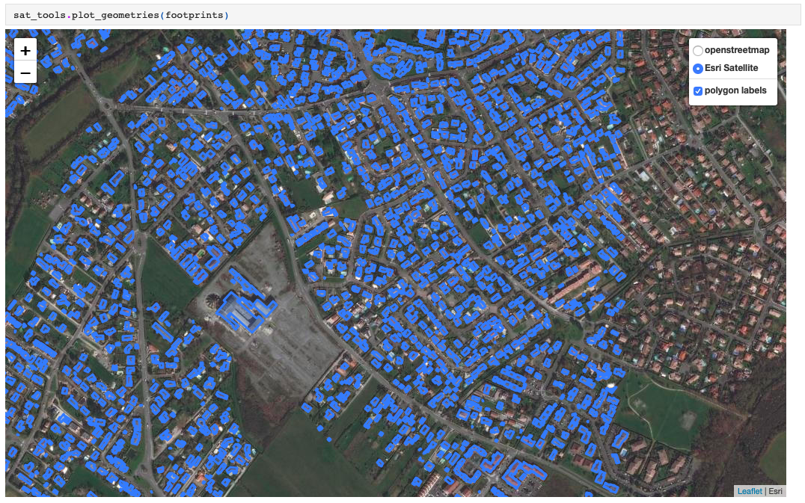

# totalsat

Totalsat is a Python package to **easily download and preprocess Sentinel-2 and Landsat 5-7-8 images directly in a Jupyter notebook**. It also includes **additional satellite-related tools such as image labelling, image splitting, map data plotting, reverse geocoding, etc**.

The package is built on top of **GDAL, Google Earth Engine and the [coastsat](https://github.com/kvos/CoastSat) library**. I developed it as an open-source project during my intership at Total in Paris (July 2020). This project **wasn't meant for production** - it's more of a quick hack to facilitate satellite image analysis. Therefore many things aren't 100% clean and could still be optimized - you're welcome to re-use and adapt everything to your needs!

### Quick start

For of all, make sure you create a new environment using `conda env create -f environment.yml -n totalsat`. You can then take a look at the demo notebook (`totalsat_demo.html`, and `.ipynb` version in the `demo_files` folder) to get started !

For the record, you'll also find below a few examples of what you can do with `totalsat`. The full set of examples with code are in the demo notebook, and all functions accross the 3 modules (`sat_download`, `sat_preprocess` and `sat_tools`) are documented in the `documentation` folder.

* `sat_download` module

With this module, you can download images from Sentinel or Landsat satellites over a chosen area and with multiple parameters, including splitting the satellite bands in smaller tiles for easier manipulation, as visualized below.

* `sat_preprocess` module

With this module, you can stack spectral bands to obtain regular RGB images, or compute custom remote sensing indices - below, the Normalized Difference Water Index (NDWI) and a custom index computed as R * 1, NIR * 0.5, B * 0.7.

|  |  |
| ------------- | ------------- |

* `sat_tools` module

With this module, you can perform a set of tasks to facilitate satellite image analysis, among which image splitting and image labelling. The image labelling tool uses `qt` to open a matplotlib user interface in a new window, where you can delineate polygons on your images, or simply define binary labels for classification. Labels are saved as either a csv or a list of polygon coordinates in GeoJSON format.

|  |  |
| ------------- | ------------- |

Finally (but see more in the demo), you can use this module to download and plot map data queried from OpenStreetMap (using the great `osmnx` library).

